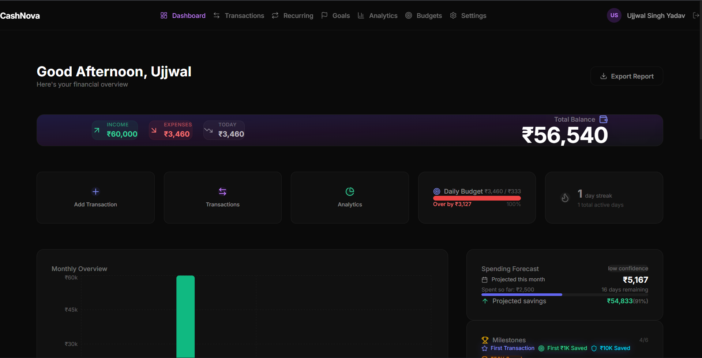
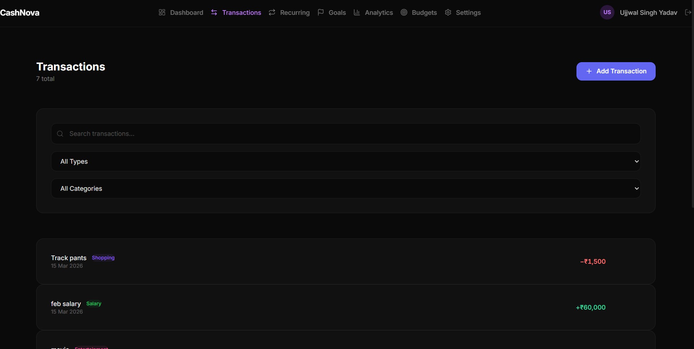
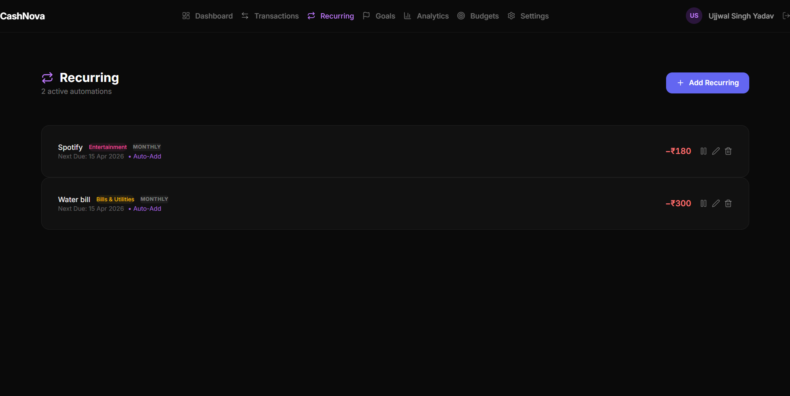
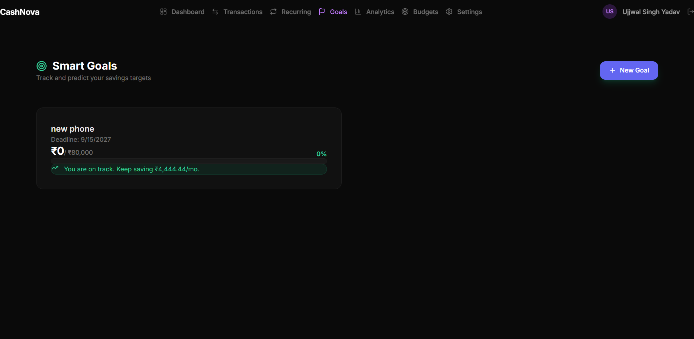
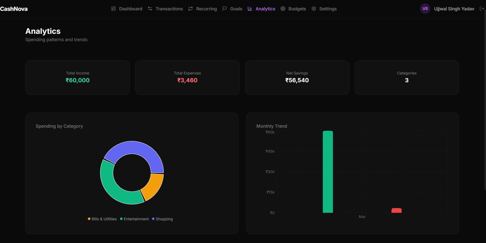

# CashNova


CashNova is an AI-powered financial management dashboard that allows users to track transactions, manage budgets, analyze spending, generate financial insights, and plan financial goals.

## Project Overview

Welcome to CashNova! This application provides a comprehensive suite of tools to take control of your personal finances. From tracking daily expenses to forecasting future savings, CashNova offers a complete snapshot of your financial health. Make informed decisions and achieve your monetary goals with our intuitive and smart platform.

## Feature Highlights

- **Live Application**: [https://cashnova-mu.vercel.app/](https://cashnova-mu.vercel.app/)
- **All-in-One Dashboard**: View your complete financial summary at a glance.
- **AI-Powered Insights**: Actionable financial guidance generated dynamically.
- **Smart Analytics**: Deep dive into spending behaviors with intuitive charts.
- **Goal Tracking**: Plan for your future with interactive milestones.
- **Seamless Integrations**: Simplified Google OAuth and secure data handling.

### Dashboard
The financial dashboard serves as your mission control. It displays an immediate overview of your current balance, recent income, recent expenses, analytics snapshots, and AI-driven insights. It also offers quick-action buttons to directly add new transactions without navigating away.

### AI Insights
CashNova utilizes a powerful Machine Learning service integrated directly into your financial profile to generate custom AI-powered insights. This includes a spending forecast for the current month, projected savings trajectory, and intelligent tracking of financial milestones.

### Transactions
Easily record and organize all your financial movements. The dedicated transactions tab allows you to view detailed histories of income and expenses, search through past records, and categorize your spending for better tracking.

### Recurring Payments
Never miss a bill again. Set up recurring transactions for subscriptions, rent, utilities, or EMIs. The system automatically records these at your scheduled intervals, ensuring your cash flow projections are always accurate and up-to-date.

### Smart Goals
Plan for massive life events or simple savings targets. Create financial goals with defined deadlines and target amounts, track your progress incrementally, and receive insight on whether you are "on track" to meet your purchase or savings targets.

### Analytics
Turn raw transaction data into visual knowledge. Our analytics suite provides insightful charts breaking down your income trends, spending patterns by category, and long-term financial behavior to identify areas where you can save more.

### Budget System
Maintain discipline over your spending. Plan category-based budgets (e.g., Groceries, Entertainment, Utilities) and monitor them dynamically. The system visually tracks how much of your allocated budget has been utilized in real-time.

### Export Reports
Need your data offline? Easily export your entire financial history and activity as a structured JSON file, giving you complete data portability and personal offline backups.

## Tech Stack

**Frontend:**
- React
- Vite
- TailwindCSS
- Chart.js

**Backend:**
- Node.js
- Express.js

**Database:**
- SQL Database

**Services & Authentication:**
- Google OAuth Authentication
- ML Service (AI Insight Generation)

## Project Screenshots

Here is a visual overview of the application:

**Dashboard**


**Transactions**


**Recurring**


**Goals**


**Analytics**


## Project Architecture

The architecture relies on a robust React frontend connected to an Express API layer, which manages the core SQL database interactions and interfaces with our specialized ML service.

```
React Frontend
      ↓
Express Backend
      ↓
SQL Database
      ↓
ML Service
```

## Folder Structure

```
CashNova/
├── src/            # React frontend application
├── server/         # Backend API and server logic
├── ml-service/     # AI insight generation models and endpoints
└── public/         # Static assets and images
```

## Installation

1. **Clone the repository**
   ```bash
   git clone https://github.com/usy8189/CashNova.git
   cd CashNova
   ```

2. **Install frontend dependencies**
   ```bash
   npm install
   ```

3. **Install backend dependencies**
   ```bash
   cd server
   npm install
   ```

## Environment Variables

To properly run the application, create a `.env` file in the `server/` directory and include the required keys:

```ini
PORT=5000
DATABASE_URL=your_sql_database_url
GOOGLE_CLIENT_ID=your_google_oauth_client_id
GOOGLE_CLIENT_SECRET=your_google_oauth_secret
ML_SERVICE_URL=http://localhost:5001
```

*(Also ensure your frontend has the necessary `.env` variables if configured via Vite)*

## Running the Application

**Start the Backend Server:**
```bash
cd server
npm start
```

**Start the React Development Server:**
```bash
# In the project root
npm run dev
```

The application is deployed live at [https://cashnova-mu.vercel.app/](https://cashnova-mu.vercel.app/).

## Future Improvements

- Fully containerized deployments using Docker.
- Advanced predictive modeling for investment returns.
- Native mobile application using React Native.
- Multi-currency support and live exchange rates.

## Contributing

Contributions are what make the open-source community such an amazing place to learn, inspire, and create. Any contributions you make are **greatly appreciated**.

1. Fork the Project
2. Create your Feature Branch (`git checkout -b feature/AmazingFeature`)
3. Commit your Changes (`git commit -m 'Add some AmazingFeature'`)
4. Push to the Branch (`git push origin feature/AmazingFeature`)
5. Open a Pull Request

## License

Distributed under the MIT License. See `LICENSE` for more information.
